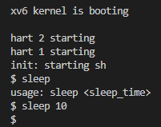

# Lab01 Utility

## Boot xv6

#### 1. 实验目的
启动xv6操作系统
#### 2. 实验内容
输入命令:
```bash
$ make qemu
```
#### 3. 遇到的问题及解决方法
无
#### 4. 实验心得
成功启动xv6.


## sleep
#### 1. 实验目的
通过编写UNIX程序实现系统``sleep``功能. ``sleep``接收一个整型参数: 休眠的时间.编写的程序应为``user/sleep.c``
#### 2. 实验内容
1.  阅读``user/``目录下的其他程序(如``user/echo.c``, ``user/grep.c``等)了解如何获取命令行参数.
2.  新建``user/sleep.c``, 编写程序.用``int main(int argc, char **argv)``传参.``argv[0]``是可执行文件名; ``argc``是参数个数, 最小为1, 即argv[0]. 若``argc==1``则告知用户需要输入时间.若参数合法则调用系统调用sleep.最后退出程序.
3.  更改``Makefile``中的``UPROGS``，加入``$U/_sleep\``

#### 3. 遇到的问题及解决方法
在xv6的用户态下程序不能调用``return 0``而应该用``exit(0)``.
#### 4. 实验心得
这个实验是xv6实验的热身, 体验了从用户态通过系统调用访问内核态.
#### 5. 实验截图


## pingpong
#### 1. 实验目的
编写一个使用UNIX系统调用的程序来在两个进程之间“ping-pong”一个字节，请使用两个管道，每个方向一个。父进程应该向子进程发送一个字节;子进程应该打印“\<pid\>: received ping”，其中\<pid\>是进程ID，并在管道中写入字节发送给父进程，然后退出;父级应该从读取从子进程而来的字节，打印“\<pid\>: received pong”，然后退出。用户态源代码在文件``user/pingpong.c``中。
#### 2. 实验内容
在main函数中，用``fork()``创建一个子进程。创建两个管道。创建管道的具体操作为
```cpp
int pd[2];
pipe(fd);
```
在两个进程中对两个管道进行读写。并输出ping/pong，发送pong/ping.可以用``getpid()``获取当前进程的pid。

更改``Makefile``中的``UPROGS``，加入``$U/_pingpong\``

#### 3. 遇到的问题及解决方法
1.  不熟悉UNIX管道。不熟悉管道的相关操作，包括声明管道、写入或读取管道信息、关闭管道端等等。通过查阅相关资料了解了管道的基本使用方式。
2.  空闲管道端的关闭。起初，我没有关闭空闲管道端，造成了一些困扰。在课上老师反复强调进程是分配资源的单位。所以每个进程都要对管道端进行操作。
3.  进程同步互斥问题。起初，我在程序中规定控制台输出在进程的末尾。结果输出的是乱码。原因是在这种情况下，控制台是临界资源，只能互斥访问，而程序中没有进行同步互斥。解决方法有三种：
    1.  使用Peterson算法。
    2.  使用xv6自带的spinlock。
    3.  通过限制输出顺序消除同步互斥，即一旦接收到数据立刻输出，类似Tomasulo算法。最终我采用的是这种方法。

#### 4. 实验心得
这个实验虽小，但是收获颇丰。首先，我练习使用了``fork()``函数；其次，我熟悉了UNIX的管道机制；更重要的是，我在实践中首次遇到同步互斥问题，并想到Peterson算法，将理论运用到实际中。

#### 5. 实验截图


## primes
#### 1. 实验目的
使用管道编写``prime sieve``的并发版本. 具体原理图如下:

图中每一个矩形框是一个进程，进程间通过管道传输数据，输入的数据是从2开始的连续自然数组成的数组。每个管道将数组第一个元素作为本管道输出的素数。并按顺序检验数组后续数字是否能被该素数整除。若不能，则将其写入另一数组中。完成该流程后，将此数组传给下一管道。源程序放在``/user/primes.c``。
#### 2. 实验内容
**通过编写一个递归函数实现不断向前推进的过程**，参数是左邻居进程创建的管道。由于xv6被分配的资源受限，这里只传到35.
1.  在main函数中创建初始管道，输入从2到35。
2.  在main函数中创建一个进程。若为子进程，则调用递归函数；若为父进程，则关闭管道端，等待子进程退出后退出。
3.  递归函数中，关闭传入管道写端的写端；创建一个管道，关闭读端。从父管道都第一个数，这是这个进程获取的素数，将其打印。接着依次读出管道内其他数。若不能被该进程获取的素数整除，则写入本进程创建的管道中。接着创建子进程，进入子进程（递归）。子进程结束后，父进程退出。
4.  更改``Makefile``中的``UPROGS``，加入``$U/_primes\``
#### 3. 遇到的问题及解决方法
一开始我没有规定父进程一定要等子进程退出后退出。出现父进程在子进程运行时退出的情况，导致操作系统继续接收用户输入。出现如下情况：
```bash
$
prime 2
$prime 3
prime 5
...
```
在规定父进程只有在子进程退出后才能退出后，该问题消失。由于本进程申请了多个子进程，容易发生资源不够的情况。所以不用的管道端一定要关闭，否则panic。
#### 4. 实验心得
本实验了解了``primes sieve``的原理并简单实现了``primes sieve``，对并行编程和递归思想有了全新的认识。多进程的递归可以充分发挥多核CPU的优势，提高递归性能。在实现"primes sieve" 算法时，算法的效率受到空间复杂度的影响。虽然该算法的时间复杂度较低，但它需要使用一个长度为n的数组来存储中间结果，因此空间复杂度为O(n)。对于较大的输入范围，可能需要考虑优化空间复杂度，例如使用位图来代替普通数组来节省空间。

#### 5. 实验截图


## find
#### 1. 实验目的
编写一个简化版本的UNIX的``find``程序：查找目录树中具有特定名称的所有文件。源程序放在``/user/find.c``。
#### 2. 实验内容

参考``user/ls.c``中的内容，编写一个递归函数``void find(char *path, const char *filename)``实现对目录的递归查找。基本步骤是：

1. 声明变量，存放包括``open()``返回值的整型变量，路径结构体``struct dirent de``、分析结构体``struct stat st``等。
2. 打开管道。
3. 检查传入参数的正确性，包括是否能打开、``find()``的第一个参数是否是目录、是否可以分析、目录是否超长等等。
4. 排除``.``和``..``，若是文件，与目标文件名做``strcmp``，若一致则输出完整目录；若是目录，则递归查找。
5. 关闭管道。
6. 更改``Makefile``中的``UPROGS``，加入``$U/_find\``

#### 3. 遇到的问题及解决方法

在做实验之前没有注意到UNIX的ls命令会把``.``和``..``包括在内，所以一开始没有排除这两个目录，造成了一些困扰；搜索时没有用绝对目录，也报了一些错；一开始使用了strcpy，操作系统提示无此函数，后来改为用``memmove()``、``memset()``和``memcpy()``系列函数，解决了这些问题。

#### 4. 实验心得

之前在Windows下写过类似功能的函数，这次在实验中写了相似功能的实验，进一步熟悉了UNIX，并发现了WIndows和UNIX的一些不同，比如Windows使用句柄，而UNIX多用管道。另外，我还了解了一下echo。

#### 5. 实验截图


## xargs
#### 1. 实验目的
编写一个简化版UNIX的``xargs``程序：它从标准输入中按行读取，并且为每一行执行一个命令，将行作为参数提供给命令。源程序在``user/xargs.c``
#### 2. 实验内容

1. 获取前一命令的标准化输出：使用``read()``函数获取。``read(0, buf, MSGSIZE)``
2. 获取自己的命令行参数：通过带参main函数读取。定义大小为``MAXARG``大小的``char*``数组``xargv``，从1复制``argv``到``xargv``。
3. 如何使用exec执行命令： 读取buf中内容（以``\n``为终止符），并创建子进程。子进程先将操作放入``xargv``，再整理参数，放入``xargv``。最后调用``exec(xargv[0],xargv)``执行操作即可，子进程退出。父进程指向buf下一个字符并等待子进程退出。
4. 更改``Makefile``中的``UPROGS``，加入``$U/_xargs\``

#### 3. 遇到的问题及解决方法

由于对bash命令的了解有限，我不太了解xargs和grep是什么意思，所以对于实验要求也一知半解，在查阅资料并观看视频后，我了解到xargs的是“extended augrents”。它与管道符连用，用管道左侧的输出作为管道右侧的命令行参数。例如可以

```bash
echo 10 | xargs sleep # 相当于sleep 10
```

表示``sleep 10``。在阅读实验给出的提示后，我使用exec完成了执行。

#### 4. 实验心得

本实验让我了解了UNIX下的xargs命令，增进了对bash命令的了解。通过实现xargs，我更深入地理解了操作系统的工作原理，学会了如何在xv6中进行进程管理和管道通信。这让我对UNIX操作系统和相关的命令行工具有了更深入的认识。同时，这也锻炼了我的C语言编程能力和问题解决能力。我也明白了bash中的某些指令不需要进入内核态，而只需要调用系统调用即可完成，本质上是一个用户态的命令行程序。

#### 5. 实验截图


### make grade截图


### 代码位置

`user/sleep.c`

`user/pingpong.c`

`user/find.c`

`user/primes.c`

`user/xargs.c`

`Makefile col:196~200`

