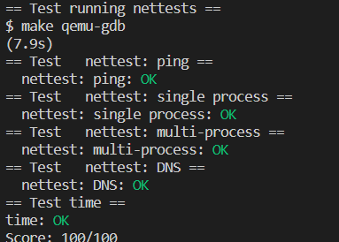

# Lab07 networking

## network driver

### 实验目的

在***kernel/e1000.c***中完成`e1000_transmit()`和`e1000_recv()`，以便驱动程序可以发送和接收数据包。，以实现用e1000设备进行网络通信。

### 实验内容

1. 完成`e1000_transmit()`
   1. 上锁
   2. 获取tx环索引，若越界则报错
   3. 填充描述符
   4. 更新环位置
   5. 解锁
2. 完成`e1000_recv()`
   1. 获取rx索引，若没有数据则向后移动一位。
   2. 判断包是否可用，即 E1000 是否真的写入数据包了
   3. 更新包缓冲区，即填充mbuf结构体，并推送网络栈
   4. 为刚才的mbuf分配kongjian
   5. 更新尾指针，更新为最后处理的环描述符的索引

### 遇到的问题和解决方法

对网络通信与网卡驱动相关知识不了解。解决方法是跟着hint做，并查阅csdn、博客园等网站。

### 实验心得

是一个生产者-消费者模型的应用，原因是数据的写入在一个循环索引上；且有头指针和尾指针，若两个指针指向同一索引则视为队列满

## Make grade 截图

## 代码位置

`kernel/e1000.c` col: 96，147
